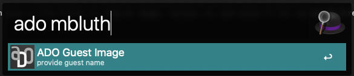
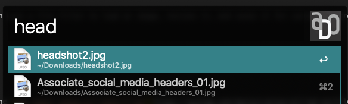
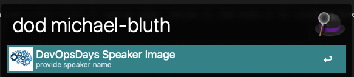

# alfred-workflows
This is a repo of workflows I have created for Alfred. They might be useful to you. They might not be.

## ado-guest-image

Alfred 4.0 workflow which uses a file filter to load an image, resizes it, and saves it for use as an Arrested DevOps guest image

### Dependencies

Requires [ImageMagick](https://imagemagick.org/)

### Installation

1. Download and import the [ado-guest-image.alfredworkflow](https://github.com/mattstratton/alfred-workflows/blob/master/workflows/ado-guest-image.alfredworkflow) workflow file
1. Set the `CONVERT_PATH` variable for the path to the imagemagick binary. For example, `/usr/local/bin/convert`
1. Set the `DEST_DIR` variable for the path to the static folder for ADO guests. For example, `/Users/me/ado-hugo/static/img/guests/`
1. Set the `DOWNLOAD_PATH` variable for the path for Alfred to look for images For example, `~/Downloads/`

### Usage

`ado ${GUEST_NAME}`

```
pshop mbluth
```





## dod-speaker-image

Alfred 4.0 workflow which uses a file filter to load an image, resizes it, and saves it for use as a DevOpsDays speaker image

### Dependencies

Requires [ImageMagick](https://imagemagick.org/)

### Installation

1. Download and import the [dod-speaker-image.alfredworkflow](https://github.com/mattstratton/alfred-workflows/blob/master/workflows/dod-speaker-image.alfredworkflow) workflow file
1. Set the `CONVERT_PATH` variable for the path to the imagemagick binary. For example, `/usr/local/bin/convert`
1. Set the `DEST_DIR` variable for the path to your event's speakers folder. For example, `Users/me/devopsdays-web/static/events/2020-ponyville/speakers`
1. Set the `DOWNLOAD_PATH` variable for the path for Alfred to look for images For example, `~/Downloads/`

### Usage

`dod ${SPEAKER_NAME}`

```
dod michael-bluth
```



